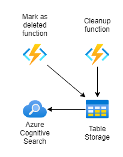
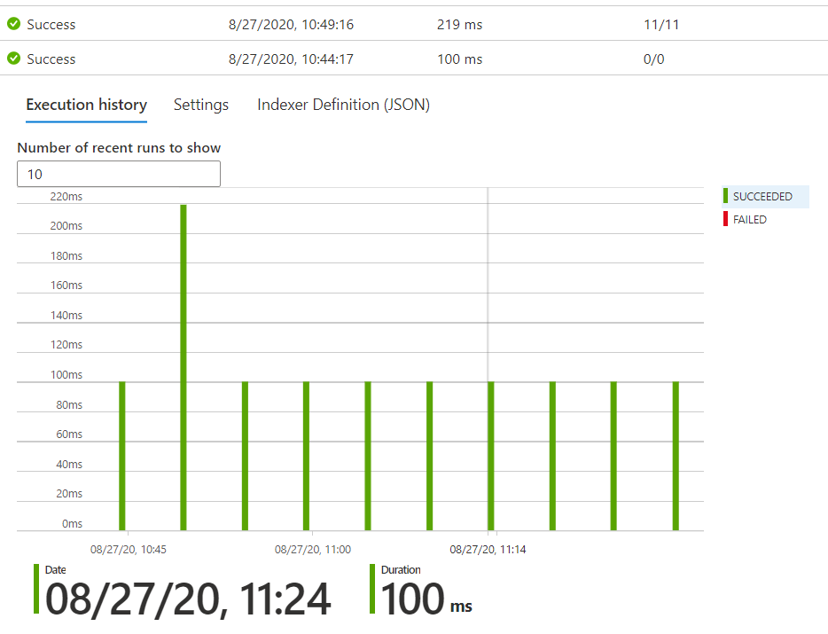
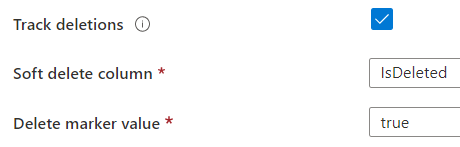

# [5/100] Azure Cognitive Search - Delete detection

## Introduction

In one of my cloud native projects I have a problem with Azure Search index and old data visible in it. Goal is to remove old/removed data from index to give correct results to end users.

## Prerequisite

Basic understanding of [Azure Cognitive Search](https://docs.microsoft.com/en-us/azure/search/) and some data in [Table Storage](https://docs.microsoft.com/en-us/azure/storage/tables/table-storage-overview).

## Use Case

- In this scenario indexed data is stored in Azure Cognitive Search Index for autocomplete functionality and search in end application.
- **Mark as deleted function** mark data as deleted and data source connection knows which data remove from index.
- **Cleanup function** removes marked data from Table Storage.

## Cloud Research
The goal is to remove items from index in Azure Cognitive Search service. Below are results from indexer where I'm finally able to remove 11 items from index.

During this research I learn about **dataDeletionDetectionPolicy** and how indexing works with different kind of data source. I my use case I need to deal with Table Storage so guide from https://docs.microsoft.com/en-us/azure/search/search-howto-indexing-azure-tables#incremental-indexing-and-deletion-detection is helpful.

Finally I add column **IsDelete** to my entities and configure data source

## Try yourself

### Step 1 — Summary of Step

1. Create some kind of data source (Table Storage, Cosmos DB, Blob Storage)
2. Create Azure Cognitive Search Free Tier
3. Add data to data source. **Remember to add column isDeleted to yours structure.**

### Step 2 — Summary of Step

1. Setup data source in Azure Search service
2. Setup data source structure
3. Configure indexer
4. Execute indexer
5. Check number of items in index

### Step 3 — Summary of Step

1. Mark some entities as deleted
2. Execute indexer
3. Check number of items in index

## ☁️ Cloud Outcome

I learn how to better configure Azure Search service and how to remove old items from index. My client is also happy because functionality finally works as expected 😊.

## Next Steps

Learn about monitoring & security. Go back to patch of AZ-303 exam.

## Social Proof

[Twitter](https://twitter.com/maciejgos/status/1298922061717540865)
